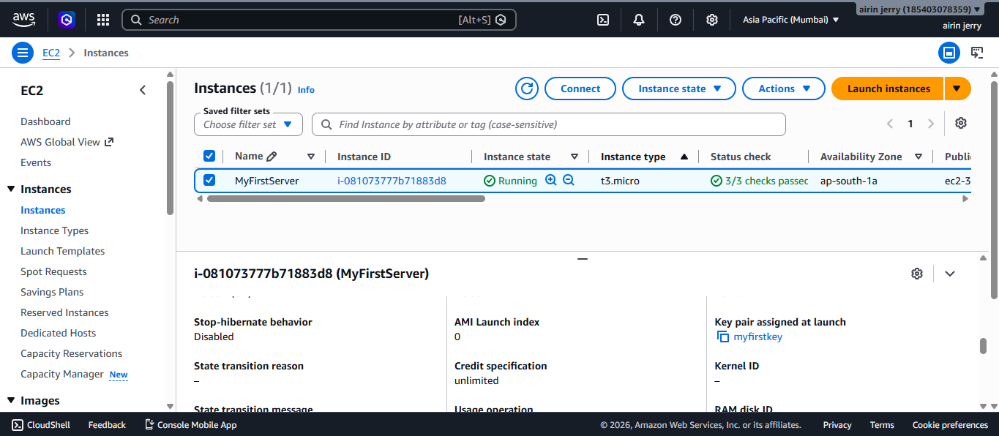
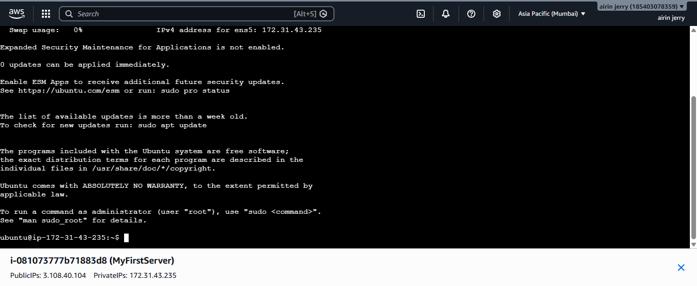
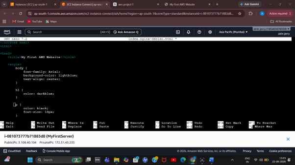
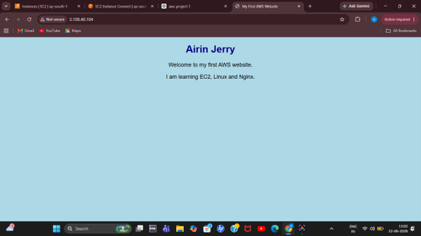

# AWS EC2 Static Website Hosting

## Project Overview

This project demonstrates how to deploy a static website on an AWS EC2 instance using Ubuntu Linux and Nginx.
The objective of this project was to gain hands-on experience with AWS cloud services, Linux server administration, web server configuration, and website deployment.
The website was built using HTML and CSS and hosted on an Ubuntu EC2 instance configured with Nginx.

---

## Technologies Used

* AWS EC2
* Ubuntu Linux
* Nginx
* HTML
* CSS
* Linux Command Line
* EC2 Instance Connect

---

## Project Architecture

```text
Internet
    │
    ▼
AWS EC2 Instance
    │
    ▼
Ubuntu Server
    │
    ▼
Nginx Web Server
    │
    ▼
HTML + CSS Website
```

---

## Features

* Launched and configured an EC2 instance
* Configured Security Groups for web access
* Connected securely to the server using EC2 Instance Connect
* Installed and verified Nginx web server
* Hosted a custom HTML/CSS website
* Accessed the website using the EC2 Public IP address
* Modified website content directly from the Linux terminal

---

## Learning Outcomes

Through this project, I learned:

* Fundamentals of Cloud Computing
* AWS EC2 Instance Management
* Security Groups and Network Access Control
* Linux Terminal Navigation
* Basic Linux Commands
* Installing and Managing Services with Systemctl
* Nginx Installation and Configuration
* Static Website Deployment
* Hosting Applications on Cloud Infrastructure

---

## Deployment Steps

### 1. Launch EC2 Instance

* Created an Ubuntu EC2 instance
* Selected an appropriate instance type
* Configured networking settings
* Created and associated a key pair

### 2. Configure Security Group

Allowed inbound traffic for:

* SSH (Port 22)
* HTTP (Port 80)

### 3. Connect to EC2

Connected to the Ubuntu server using EC2 Instance Connect.

### 4. Install Nginx

```bash
sudo apt update
sudo apt install nginx -y
```

### 5. Verify Nginx Service

```bash
sudo systemctl status nginx
```

Expected output:

```bash
active (running)
```

### 6. Edit Website Content

Modified the default Nginx webpage:

```bash
sudo nano /var/www/html/index.nginx-debian.html
```

### 7. Access the Website

Opened the website using the EC2 Public IP address in a browser.

---

## Screenshots

### EC2 Instance Running

Successfully launched the EC2 instance and verified that all status checks passed.



---

### EC2 Terminal Connection

Connected to the Ubuntu server using EC2 Instance Connect and accessed the Linux terminal.



---

### Editing Website Source Code

Modified the default Nginx webpage by editing the HTML file directly on the server using the Nano text editor.



---

### Final Website Output

Successfully deployed and hosted a custom HTML and CSS website on AWS EC2 using Nginx.




## Website Preview

The website contains:

* Personal Introduction
* Basic Styling using CSS
* AWS Learning Showcase
* Static Website Deployment Demonstration

---

## Future Improvements

* Register a custom domain name
* Configure HTTPS using SSL/TLS
* Deploy a React application
* Host a Flask backend
* Configure CI/CD pipelines
* Explore AWS S3 for static website hosting
* Implement Load Balancers and Auto Scaling

---

## Author

**Airin Jerry**

Computer Science Engineering Student

Currently learning:

* AWS Cloud Computing
* Linux Administration
* DevOps Fundamentals
* Full Stack Development

GitHub: https://github.com/airin966
